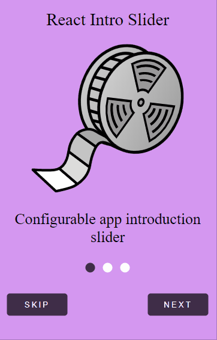

<h1>react-intro-slider</h1>

<p>Easy-to-use yet very configurable app introduction slider</p>

[](./LICENSE)
[](https://github.com/dimitamp/react-intro-slider)


## Quick Start

```sh
npm i react-intro-slider --save
```
| | |
|-|-|
 | 

## Demo

<a href="https://codesandbox.io/embed/cocky-voice-l8ti1"> Try it online</a>

## Table of contents
  * [Props and options](#props-and-options)
    * [Configure behaviour](#configure-behaviour)
    * [Configure looks](#configure-looks)
    * [Methods](#methods)
  * [Example](#example)
 

<h2>Props and options</h2>

### Configure looks

Name                       | Type       | Default                   | Description
---------------------------|------------|---------------------------|--------------
size                       | `string`   | `medium`                  | Size of slider. Possible values: `small`, `medium`,`large`,`fullscreen`
titleStyle                 | `string`   | `null`                    | Styling for slide title
imageStyle                 | `string`   | `null`                    | Styling for slide image
descriptionStyle           | `string`   | `null`                    | Styling for slide description
skipButtonStyle            | `style`    | `null`                    | Styling for skip button
nextButtonStyle            | `style`    | `null`                    | Styling for next button
controllerActiveIconStyle  | `style`    | `null`                    | Style of active pagination dots
controllerInactiveIconStyle| `style`    | `null`                    | Style of inactive pagination dots
sliderStyle                | `style`    | `null`                    | Style of slider container
nextLabel                  | `string`   | `NEXT`                    | Label of next button
skipLabel                  | `string`   | `SKIP`                    | Label of skip button
doneLabel                  | `string`   | `DONE`                    | Label of done button


### Configure behavior

Name                  | Type       | Default                   | Description
----------------------|------------|---------------------------|--------------
slides                | `array`    | No default, required      | An array of objects 
skipButton            | `boolean`  | `false`                   | Enable to show a skip button to the left of pagination dots 
nextButton            | `boolean`  | `true`                    | Disable to hide the next button
closeOnOverlayClick   | `boolean`  | `true`                    | Disable to keep slider open 
controllerOrientation | `string`   | `vertical`                | Orientation of the control buttons. Possible values: `vertical`,`horizontal`
sliderIsOpen          | `boolean`  | `false`                   | Enable to show slider 

### Methods
Method Name | Description
------------|----------------
handleDone  | Callback function triggered when user presses done
handleClose | Callback function triggered when slider closes because of overlay click or skip button press


<h2>Example</h2>

You can run the example Expo-app by cloning the repo:


```sh
git clone https://github.com/dimitamp/react-intro-slider.git
cd react-intro-slider 
npm install
npm start 
```
